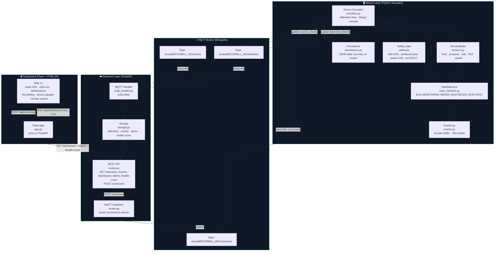
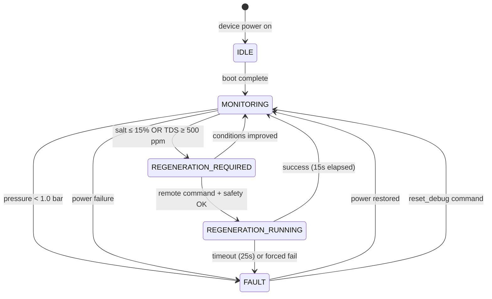
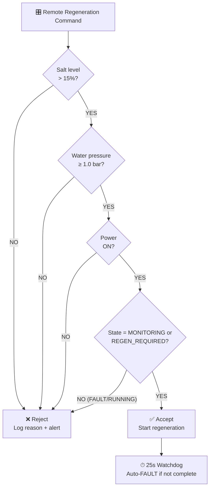

# EcoWell IoT System — Architecture Diagram

```mermaid
graph TB
    subgraph DEVICE["🖥️ Device Layer (Python Simulator)"]
        S["SensorModel<br/>sensors.py<br/>flow · pressure · salt · TDS · power"]
        FSM["StateMachine<br/>state_machine.py<br/>IDLE·MONITORING·REGEN_REQ·REGEN_RUN·FAULT"]
        SAFE["Safety Gate<br/>safety.py<br/>salt>15% · pressure≥1bar · power=ON · not FAULT"]
        PERSIST["Persistence<br/>persistance.py<br/>JSON state recovery on restart"]
        EVENTS["EventLog<br/>events.py<br/>circular buffer · 100 events"]
        SIM["Device Simulator<br/>simulator.py<br/>telemetry loop · debug console"]

        S --> FSM
        FSM --> EVENTS
        SIM --> S
        SIM --> FSM
        SIM --> SAFE
        SIM --> PERSIST
    end

    subgraph BROKER["📡 MQTT Broker (Mosquitto)"]
        TEL["Topic: ecowell/ECOWELL_001/telemetry"]
        EVT["Topic: ecowell/ECOWELL_001/events"]
        CMD["Topic: ecowell/ECOWELL_001/command"]
    end

    subgraph BACKEND["☁️ Backend Layer (FastAPI)"]
        MH["MQTT Handler<br/>mqtt_handler.py<br/>subscriber"]
        STORE["Storage<br/>storage.py<br/>telemetry · events · alerts · health score"]
        API["REST API<br/>routes.py<br/>GET /telemetry, /events, /dashboard, /alerts, /health-score<br/>POST /command"]
        PUB["MQTT Publisher<br/>routes.py<br/>sends command to device"]
    end

    subgraph DASHBOARD["🌐 Dashboard (Flask + HTML/JS)"]
        FLASK["Flask App<br/>app.py<br/>proxy to FastAPI"]
        UI["Web UI<br/>index.html · style.css · dashboard.js<br/>live polling · sensor gauges · remote control"]
    end

    %% Device → Broker
    SIM -->|"publish telemetry (JSON)"| TEL
    SIM -->|"publish events (JSON)"| EVT
    CMD -->|"subscribe commands"| SIM

    %% Broker → Backend
    TEL -->|"subscribe"| MH
    EVT -->|"subscribe"| MH
    MH --> STORE

    %% Backend API
    STORE --> API
    API -->|"POST /command"| PUB
    PUB -->|"publish"| CMD

    %% Dashboard
    FLASK -->|"GET /dashboard + /alerts + /health-score"| API
    UI -->|"fetch /api/dashboard every 1.5s"| FLASK
    UI -->|"POST /api/command"| FLASK

    style DEVICE fill:#0e1826,stroke:#3b9dff,color:#e8f0fe
    style BROKER fill:#0e1826,stroke:#00e5c3,color:#e8f0fe
    style BACKEND fill:#0e1826,stroke:#22d86e,color:#e8f0fe
    style DASHBOARD fill:#0e1826,stroke:#9b74ff,color:#e8f0fe
```

---

## State Machine Diagram

```mermaid
stateDiagram-v2
    [*] --> IDLE : device power on

    IDLE --> MONITORING : boot complete

    MONITORING --> FAULT : pressure < 1.0 bar
    MONITORING --> FAULT : power failure
    MONITORING --> REGENERATION_REQUIRED : salt ≤ 15% OR TDS ≥ 500 ppm

    REGENERATION_REQUIRED --> MONITORING : conditions improved
    REGENERATION_REQUIRED --> REGENERATION_RUNNING : remote command + safety OK

    REGENERATION_RUNNING --> MONITORING : success (15s elapsed)
    REGENERATION_RUNNING --> FAULT : timeout (25s) or forced fail

    FAULT --> MONITORING : power restored
    FAULT --> MONITORING : reset_debug command
```

---

## Safety Check Flow

```mermaid
flowchart TD
    CMD["🎛️ Remote Regeneration Command"]
    C1{"Salt level\n> 15%?"}
    C2{"Water pressure\n≥ 1.0 bar?"}
    C3{"Power\nON?"}
    C4{"State = MONITORING or\nREGEN_REQUIRED?"}
    ACCEPT["✅ Accept\nStart regeneration"]
    REJECT["❌ Reject\nLog reason + alert"]

    CMD --> C1
    C1 -->|"NO"| REJECT
    C1 -->|"YES"| C2
    C2 -->|"NO"| REJECT
    C2 -->|"YES"| C3
    C3 -->|"NO"| REJECT
    C3 -->|"YES"| C4
    C4 -->|"NO (FAULT/RUNNING)"| REJECT
    C4 -->|"YES"| ACCEPT
    ACCEPT --> WATCH["⏱ 25s Watchdog\nAuto-FAULT if not complete"]
```
